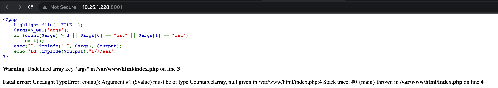
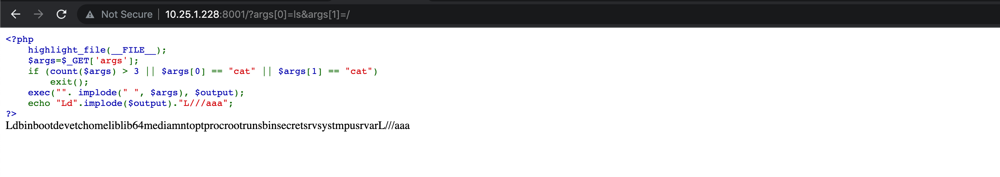
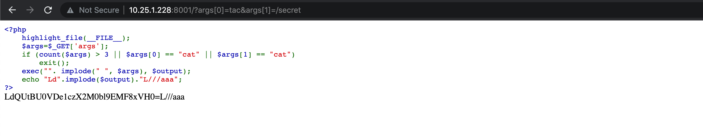

# Web

# Secret of Konoha

This challenge was pretty straightforward, visiting the url you will be greeted with the following source code



so the first it does is check how many  elements we have the `args` array, then it checks if any of the first two elements are `cat` (we can use `tac` , `head` or `tail` 😏).

Then it executes our whatever we passed in the `args` array.

Let’s try list the root directory :



we can see a secret file, let’s check it’s content:



Looks like a base64, decoding it will give us the flag

```bash
└─$ echo "QUtBU0VDe1czX2M0bl9EMF8xVH0=" | base64 -d
AKASEC{W3_c4n_D0_1T}
```
