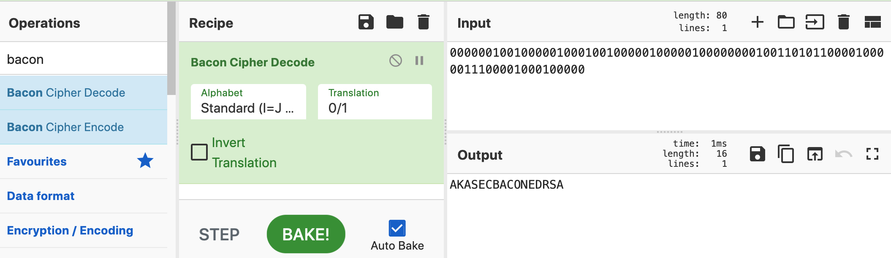

# Meganumerophobia

N = 123536064164139504718275064269913509942218319347640973269872257382194760838729086261914280412305602133850510043881523444330171567517820066827513095775693034489202078955981042875624061355151848686073635461915867708508827192798870018423289686855770187991093844972451881756937570076069209140735021093628404629683

E = 92370846707748897500296351665818073398586454136545714500109133235541482744024550126156073549534699178879840146525944763829999796895084166100935176345214466820330114013766743408230087643320164150699132430112387071160308101557300570496099251514906798335785688872418279466203772084569302164740651911244453869567

c = 18558348214847512573294588511266840380348405132842531472553850711388470657627464594921088830162510169049111893584325573658059621310419495034734959331066927106667055290456052616736656675124261379322618015210674889106071447600463640756792023778923840933422853879463970630072574489632844747555059602937877225343


Clairement c'est RSA, avec un trés grand exposant. Ce genre d'exposant est vulnérable a l'attaque de Wiener si l'exposant privé est faible.
Il n'y a qu'un seul moyen de s'en assurer:

J'ai essayé RsaCtfTool mais il m'a pris beaucoup de temp, J'ai trouvé ces scripts après avoir recherché un autre moyen: [continued_fractions](https://gist.github.com/mananpal1997/73d07cdc91d58b4eb5c818aaab2d38bd). on change les valeurs N, E et C et on lance le script:
```
┌──(kali㉿cr1ngyk4li)-[~/Rsa/]
└─$ python2 rsa_2.py
00000010010000010001001000001000001000000001001101011000010000011100001000100000
```
Premier coup d'oeil a l'output j'ai pensé que ça était en binaire mais apparemment c'est du Bacon Cipher.




FLAG : AKASEC{BACONEDRSA}


