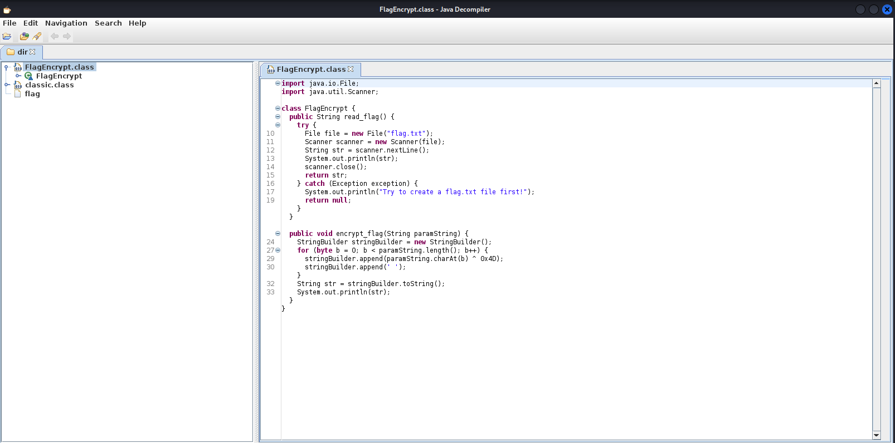

# classic

Download the challenges file, we are greeted with a flag file and 2 java classes

```bash
┌──(kali㉿cr1ngyk4li)-[~/dir]
└─$ ls -l
total 12
-rw-r--r-- 1 kali kali  405 Jun 12 02:51 classic.class
-rw-r--r-- 1 kali kali  112 Jun 12 02:51 flag
-rw-r--r-- 1 kali kali 1092 Jun 12 02:51 FlagEncrypt.class
```
flag is obviously encrypted, let's check how by decompiling`FlagEncrypt.class` with jd-gui


so the function `encrypt_flag` xor's each character of the flag with `0x4D` and append a space

```java
	for (byte b = 0; b < paramString.length(); b++) {
			stringBuilder.append(paramString.charAt(b) ^ 0x4D);
			stringBuilder.append(' ');
    	}
```
Solving this is pretty simple, we take each element and xor it again with `0x4D`:

```python
with open("flag") as f:
    l = str(f.readlines()[0])
    lst = l.split(" ")
    for i in lst:
        print(chr(int(i) ^ 0x4d), end="")
    print("\n")
```

Running it will give us the flag: `AKASEC{Hope_You_Learned_A_Thing_or_Two}`
